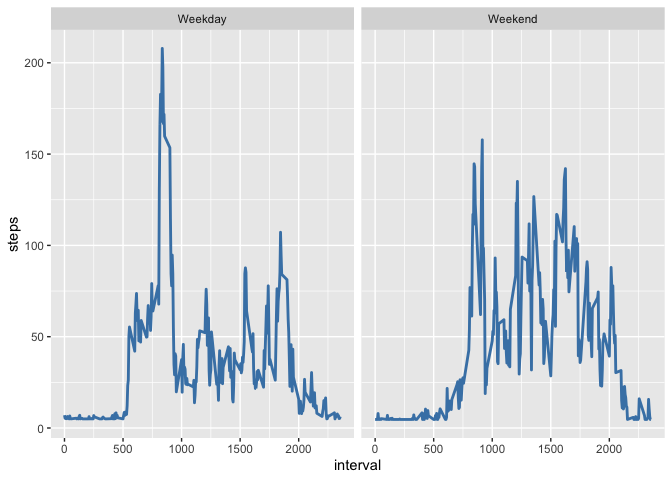

## Loading and preprocessing the data
Dependencies + Loading data

```r
library('dplyr')
```

```
## 
## Attaching package: 'dplyr'
```

```
## The following objects are masked from 'package:stats':
## 
##     filter, lag
```

```
## The following objects are masked from 'package:base':
## 
##     intersect, setdiff, setequal, union
```

```r
library(ggplot2)
library("zoo")
```

```
## 
## Attaching package: 'zoo'
```

```
## The following objects are masked from 'package:base':
## 
##     as.Date, as.Date.numeric
```

```r
data<-read.csv("activity.csv")
```

## What is mean total number of steps taken per day?
Remove nulls

```r
data_complete<-na.omit(data)
```
Now groupby

```r
daily_steps<-(data_complete %>% group_by(date) %>% summarise(steps=sum(steps)))
```
Now plot histogram

```r
hist(daily_steps$steps,main='Daily steps frequency')
```

<!-- -->
Now report mean and median.
Mean:

```r
mean(daily_steps$steps)
```

```
## [1] 10766.19
```
Median:

```r
median(daily_steps$steps)
```

```
## [1] 10765
```
## What is the average daily activity pattern?
Time series plot:

```r
interval_steps<-(data_complete %>% group_by(interval)%>%summarise(steps=mean(steps)))
interval_steps
```

```
## # A tibble: 288 × 2
##    interval  steps
##       <int>  <dbl>
##  1        0 1.72  
##  2        5 0.340 
##  3       10 0.132 
##  4       15 0.151 
##  5       20 0.0755
##  6       25 2.09  
##  7       30 0.528 
##  8       35 0.868 
##  9       40 0     
## 10       45 1.47  
## # … with 278 more rows
```

```r
ggplot(interval_steps,aes(x=interval,y=steps))+geom_line()
```

<!-- -->
Maximum:

```r
maximumsteps<-max(interval_steps$interval)
rowsatmaxvalue <-(interval_steps%>%filter(interval==maximumsteps))
rowsatmaxvalue
```

```
## # A tibble: 1 × 2
##   interval steps
##      <int> <dbl>
## 1     2355  1.08
```
So the max value is 2355
## Imputing missing values
Check eacch column

```r
sum(is.na(data$steps))
```

```
## [1] 2304
```

```r
sum(is.na(data$date))
```

```
## [1] 0
```

```r
sum(is.na(data$interval))
```

```
## [1] 0
```
So only column with nulls is steps, of which there are 2304

Now replace missing values with the overall mean

```r
data_complete <- na.omit(data)
meansteps = mean(data_complete$steps)
repdf<- data%>%replace(is.na(.),meansteps)
```
Now make histogram of total steps each day

```r
daily_steps<-(repdf%>%group_by(date)%>%summarise(steps=sum(steps)))
daily_steps
```

```
## # A tibble: 61 × 2
##    date        steps
##    <chr>       <dbl>
##  1 2012-10-01 10766.
##  2 2012-10-02   126 
##  3 2012-10-03 11352 
##  4 2012-10-04 12116 
##  5 2012-10-05 13294 
##  6 2012-10-06 15420 
##  7 2012-10-07 11015 
##  8 2012-10-08 10766.
##  9 2012-10-09 12811 
## 10 2012-10-10  9900 
## # … with 51 more rows
```

```r
hist(daily_steps$steps,main='Daily steps frequency')
```

<!-- -->
Mean:

```r
mean(daily_steps$steps)
```

```
## [1] 10766.19
```
Median:

```r
median(daily_steps$steps)
```

```
## [1] 10766.19
```
## Are there differences in activity patterns between weekdays and weekends?
Create weekday factor variable

```r
wddf<-(repdf%>%mutate(date=as.POSIXlt(date))%>%mutate(weekend=weekdays(date)))
mdf<-(wddf%>%mutate(weekend=
        case_when(
            weekend %in% c('Monday','Tuesday','Wednesday','Thursday','Friday')~"Weekday",
            weekend %in% c('Saturday','Sunday')~"Weekend"
            )))
finaldf<- (mdf%>%mutate(weekend=factor(weekend)))
```
Now plot averages

```r
tdf<-(finaldf%>%group_by(interval,weekend)%>%summarise(steps=mean(steps)))
```

```
## `summarise()` has grouped output by 'interval'. You can override using the
## `.groups` argument.
```

```r
ggplot(data=tdf,aes(interval,steps))+geom_line(color="steelblue",size=1)+
    facet_wrap(~weekend)
```

<!-- -->
